<a href="https://omaraydah.dev">
  
</a>

<p align="center">
  <a href="https://omaraydah.dev"></a>
</p>

<p align="center">
  <a href="https://www.linkedin.com/in/omar-aydah-"></a>
  <a href="https://bridge-eight-lemon.vercel.app"></a>
  <a href="mailto:omaraydah27@gmail.com"></a>
</p>

---

## > whoami

```yaml
name:      Omar Aydah
role:      Software Development Engineer  (backend · data · infra)
current:   owning backend architecture for RIGORA, an AI research
           integrity platform  ·  Virginia Tech × Gates Foundation
studying:  B.S. Computer Science  ·  Westfield State  ·  class of '27
shipped:   Bridge — a mentorship marketplace (backend API + OAuth)
i_like:    the parts that have to be right — auth, pipelines, integrations
languages: English · Arabic
```

## > featured

**RIGORA** — *private* · Virginia Tech × Gates Foundation
An AI platform that flags questionable research practices before they can shape funding decisions. I own the backend: one query fanned across **5 academic databases**, 900K+ deduplicated records, a 5-class misconduct classifier, and a statistical-layer rebuild that cut query latency **43%** and scaled tests **3.4×**.

**[Bridge](https://bridge-eight-lemon.vercel.app)** — *live* · team project
A paid mentorship marketplace. I built the backend API and integration layer, and resolved a blocking Google OAuth/Calendar issue to get scheduling reliable in production.

> **See it all, interactive, at [omaraydah.dev →](https://omaraydah.dev)** — with a live terminal you can actually type into.

## > stack


---

<p align="center">
  <a href="https://omaraydah.dev"><b>omaraydah.dev</b></a>  ·  <a href="mailto:omaraydah27@gmail.com">omaraydah27@gmail.com</a>
</p>
